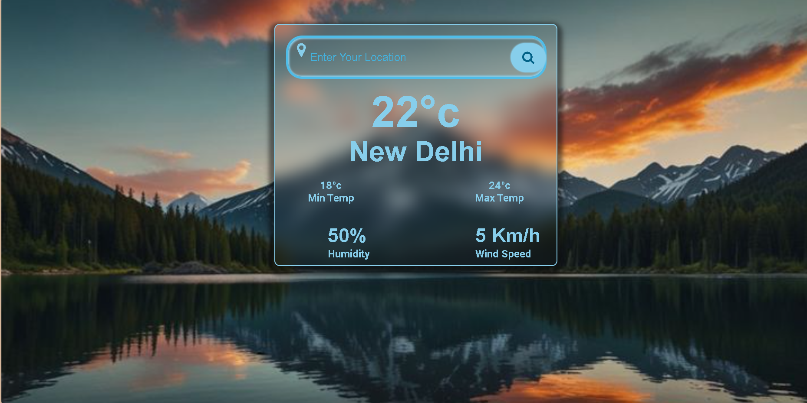

# ⛅ Weather App

A sleek, responsive Weather App that shows real-time weather updates for any city using the **OpenWeatherMap API**. Built using **HTML**, **CSS**, and **JavaScript**.



---

## 🔗 Live Demo

👉 [View Weather App](https://shubham-cyber-prog.github.io/Weather-App/)

---

## 🚀 Features

- 🌍 Real-time weather by city name  
- 🌡️ Temperature, humidity, wind speed  
- 🌤️ Weather icons based on conditions  
- 🎨 Responsive and modern UI  
- ⚙️ API integration with OpenWeatherMap  

---

## 🛠️ Tech Stack

- HTML5  
- CSS3  
- JavaScript (Vanilla)  
- OpenWeatherMap API  

---

## 📁 Folder Structure
├── index.html # Main HTML file
├── style.css # Stylesheet
├── script.js # JavaScript for API and logic
└── README.md

---

## ✨ Getting Started

1. **Clone the Repository**:
   ```bash
   git clone https://github.com/Shubham-cyber-prog/Weather-App.git

## ✍️ Author

🐾 **Author**: 👨‍💻 [Subham Nayak](https://shubham-cyber-prog.github.io/)  
🌐 [🌍 Portfolio](https://shubham-cyber-prog.github.io/) | 🔗 [LinkedIn](https://linkedin.com/in/subham-nayak-00276930b) | 🐱 [GitHub](https://github.com/Shubham-cyber-prog)


---

Let me know if you'd like:

- A badge-based layout (`shields.io` style)
- Help adding a screenshot image


